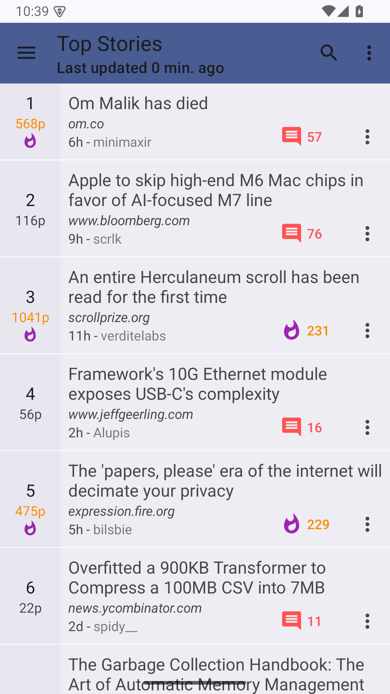
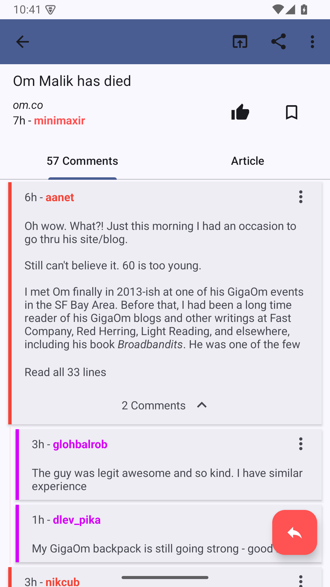
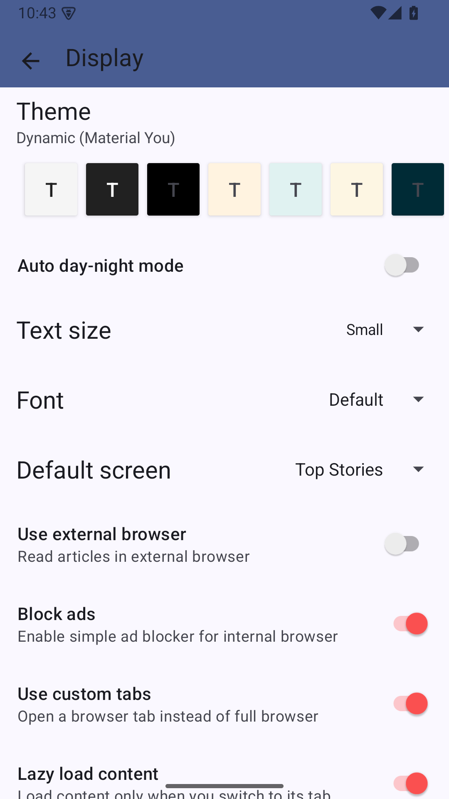

## Afterglow
Afterglow is a Material Design [Hacker News] client for Android. It is a modern, actively maintained fork of [Materialistic] by Ha Duy Trung.

> Afterglow is under active development and has not yet reached a stable 1.0 release.

### Screenshots

  
  
  
  

### Features
- Browse top, new, best, ask, show, and jobs stories
- Working Hacker News account actions: log in, vote, comment, reply, and submit
- Threaded comment navigation: jump to parent, in-thread search, collapse, and swipe gestures
- Reply notifications for your threads, plus indicators for new comments since your last visit
- Search powered by Algolia, including a date-range filter
- Material 3 / Material You design with dynamic color, plus light, dark, and true-black AMOLED themes
- Save stories and comments for offline reading
- Optional AI thread summaries, off by default: bring your own API key (Google Gemini or Anthropic Claude). Thread text is sent only when you opt in and tap Summarize
- Open links in the built-in reader or Android Custom Tabs

Uses the official Hacker News API. Account actions use your Hacker News credentials and talk to news.ycombinator.com directly.

### Setup
**Requirements**
- JDK 21
- Latest Android SDK command-line and platform tools

**Build**

    ./gradlew assembleDebug

### Built with
- [Hilt] for dependency injection
- Kotlin [Coroutines] with AndroidX [Lifecycle] ViewModel and Flow
- [Retrofit] and [OkHttp] with [Gson] for networking
- AndroidX [Room] for local storage and [WorkManager] for background reply polling
- [Material Components for Android][Material] (Material 3)
- Google [Tink] for encrypting the optional AI API key on device
- AndroidX Jetpack: AppCompat, Activity, Fragment, RecyclerView, Preference, Browser (Custom Tabs), SwipeRefreshLayout, CardView
- [Official Hacker News API][HackerNews/API] and the [Algolia Hacker News Search API]
- [PDF.js] for in-app PDF rendering

### Contributing
Contributions are welcome. Development happens on the `development` branch, so please open pull requests against `development`. Please read the [Contributing notes](CONTRIBUTING.md) first.

### Attribution
Afterglow is a fork of [Materialistic] by Ha Duy Trung, continued from the [materialistic-nouveau] fork by growse, and used under the Apache License 2.0. The original copyright notice is retained below and in the source file headers.

### License
    Copyright 2015 Ha Duy Trung

    Licensed under the Apache License, Version 2.0 (the "License");
    you may not use this file except in compliance with the License.
    You may obtain a copy of the License at

        http://www.apache.org/licenses/LICENSE-2.0

    Unless required by applicable law or agreed to in writing, software
    distributed under the License is distributed on an "AS IS" BASIS,
    WITHOUT WARRANTIES OR CONDITIONS OF ANY KIND, either express or implied.
    See the License for the specific language governing permissions and
    limitations under the License.

[Hacker News]: https://news.ycombinator.com/
[HackerNews/API]: https://github.com/HackerNews/API
[Materialistic]: https://github.com/hidroh/materialistic
[materialistic-nouveau]: https://github.com/growse/materialistic-nouveau
[Algolia Hacker News Search API]: https://github.com/algolia/hn-search
[Retrofit]: https://github.com/square/retrofit
[OkHttp]: https://github.com/square/okhttp
[Gson]: https://github.com/google/gson
[Hilt]: https://dagger.dev/hilt/
[Coroutines]: https://github.com/Kotlin/kotlinx.coroutines
[Lifecycle]: https://developer.android.com/jetpack/androidx/releases/lifecycle
[Room]: https://developer.android.com/jetpack/androidx/releases/room
[WorkManager]: https://developer.android.com/jetpack/androidx/releases/work
[Material]: https://github.com/material-components/material-components-android
[Tink]: https://github.com/tink-crypto/tink-java
[PDF.js]: https://mozilla.github.io/pdf.js/
